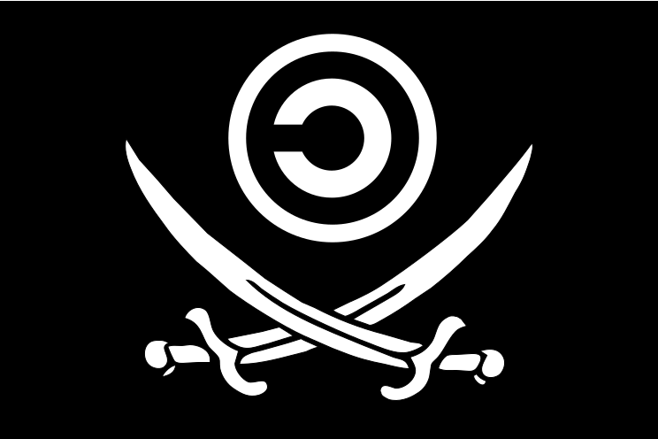

# Rebel Kollective Information Liberation License (®KILL)

The **Rebel Kollective Information Liberation License (®KILL)** is a declaration of our collective right to knowledge, freedom, and creativity. We reject the notion that information, software, and ideas can be owned or controlled by any single entity. Information is the product of centuries of human collaboration, and it belongs to everyone. This license is a call to break down the walls of proprietary systems that restrict access to knowledge, stifle innovation, and concentrate power in the hands of a few. By embracing this license, we stand united in ensuring that digital tools, software, and information remain open, free, and accessible for all.

At its core, the ®KILL is about empowerment. It provides individuals and communities the freedom to use, modify, and distribute software without fear of legal retribution or proprietary restrictions. We believe in a future where knowledge flows freely, and where the work of one becomes the collective inheritance of all. This license fosters a culture of collaboration and solidarity, encouraging innovation that benefits humanity rather than corporate interests. By removing barriers to access, we can create tools that enable everyone to grow, learn, and contribute, regardless of their circumstances.

The ®KILL stands firmly against the exploitation of knowledge for profit. It rejects the capitalist systems that commodify information and turn it into a tool of control. We oppose the surveillance and manipulation of people's data for corporate gain. Instead, we champion the ideals of collective ownership and mutual respect. This manifesto is a call to action, inviting all who believe in the free flow of information to join the movement and build a world where knowledge is liberated, not owned. Together, we can dismantle systems of control and create a future that is truly open, inclusive, and free.
